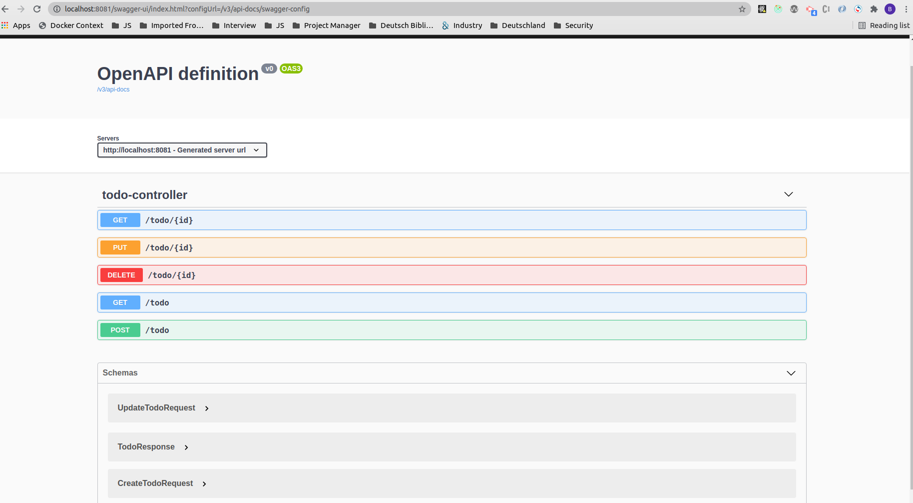

# Todo Application

A simple Spring boot application for to-do list.

# Set up

Please follow the instructions to set up

```shell
git clone git@github.com:bhaskargogs/todo-app.git
```


# Build and deploy

To build and deploy, use the following command:

```shell
gradle clean bootJar
docker-compose up -d --build
```

# Swagger

You can go to [http://localhost:8081/swagger-ui.html](http://localhost:8081/swagger-ui.html) to connect to Swagger UI.




# Shut down

To shut down, please use the following command:

```shell
docker-compose down
```